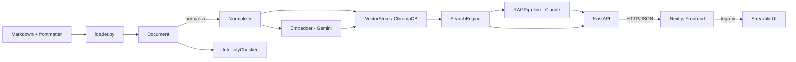

# Architecture

axis-knowledge-rag は、YAML frontmatter 付き Markdown ナレッジに対する
**軸メタデータ検索 + ベクトル検索 + RAG** を、ローカル完結で提供する Web アプリだ。
本書では、v0.3 時点のシステム全体像・主要コンポーネントの責務・データフロー・テスト/デプロイ構成を順に説明する。
個別モジュールの API は [`api-reference.md`](api-reference.md)、設計判断の根拠は [`design-decisions.md`](design-decisions.md) に分離している。

---

## 1. 概要

- **目的**: 個人〜小規模チームのナレッジ (1k〜10k 件想定) を、構造化軸とベクトル検索を組み合わせて引ける
- **構成**: Python (FastAPI backend) + TypeScript (Next.js 14 frontend)。LangChain / LlamaIndex に依存しない自前実装
- **永続化**: ChromaDB の `PersistentClient` (ローカルファイル `.chromadb/`)
- **動作モード**: 通常モード (Gemini Embedding + Claude API) / DUMMY モード (オフラインで決定論的なフォールバック)
- **レガシー UI**: `streamlit_app.py` は v0.3 でも残す (後退路・デモ用)

---

## 2. コンポーネント図 (ASCII)

```
┌─ Browser (localhost:3000) ──────────────────────────────┐
│  Next.js 14 App Router                                  │
│  ├─ SearchBar, AxisFilter, ResultCard, AnswerPanel       │
│  └─ lib/api.ts (fetch)                                   │
└──────────────────────┬───────────────────────────────────┘
                       │ HTTP/JSON (CORS)
┌──────────────────────▼───────────────────────────────────┐
│  FastAPI (localhost:8000)                                │
│  /api/{health, axes, search, answer, docs(Swagger)}      │
│  ├─ schemas.py (Pydantic v2)                             │
│  └─ Lifespan: SearchEngine, RAGPipeline, Embedder         │
└──────────────────────┬───────────────────────────────────┘
                       │
        ┌──────────────┼───────────────┐
        ▼              ▼               ▼
   loader.py     SearchEngine      RAGPipeline
   (Markdown +   (axis filter +    (Claude API,
    YAML)         vector hybrid)    citations)
        │              │               │
        └──────────────┼───────────────┘
                       ▼
                ChromaDB (.chromadb/, persistent)
                       │
                       ▼
                  Embedder
                  (Gemini text-embedding-004)
```

### 補助図 (Mermaid)



---

## 3. データフロー

### 3-1. Index time (ナレッジ取り込み)

`scripts/build_index.py <dir> [--rebuild] [--mode auto|legacy|parent_doc]` の流れ:

```
1. load_directory(dir) ──► list[Document]            (loader.py)
2. for d in docs: normalizer(d.body / d.axes / ...) (normalizer.py)
3. IntegrityChecker().check(docs)                   (integrity.py)
       └─ broken_refs / orphans / cycles を集計
       └─ --strict-integrity なら broken_refs 検出時に exit 1
4-A. mode=parent_doc (v0.7 default, ADR-017):
       chunker.chunk_markdown(d.id, d.body, fm)
         └─ list[ParentChunk] (H2 単位) + list[ChildChunk] (~256 token 小ブロック)
       embedder.embed_batch([c.text for c in children])
       vector_store.add_chunks(parents, children, embeddings)
         └─ children を ChromaDB に upsert (parent_id を metadata に持つ)
         └─ parents を data/parents.json に sidecar 保存
4-B. mode=legacy (v0.6 互換):
       embedder.embed_batch([d.normalized_body for d in docs])
       vector_store.upsert_many(docs, embeddings)
         └─ axis_* と axis_*_norm を metadata に flatten
```

### 3-1-bis. Parent Document Retrieval の構造 (spec_031)

```
.md ファイル (1 つ)
  ├─ frontmatter (axes / tags / refs / id / title)
  └─ body
       ├─ ## Section A   ─►  ParentChunk(parent_id="doc_001#section-a", text=section A 全文)
       │     ├─ paragraph 1   ─► ChildChunk(child_id="doc_001#section-a#c000", embedded)
       │     └─ paragraph 2   ─► ChildChunk(child_id="doc_001#section-a#c001", embedded)
       └─ ## Section B   ─►  ParentChunk(parent_id="doc_001#section-b", text=section B 全文)
             └─ paragraph 1   ─► ChildChunk(child_id="doc_001#section-b#c000", embedded)

検索時:
  query → embed → ChromaDB.query(top_k_children=20)
              → metadata の parent_id で dedup
              → 最良スコア child を持つ parent を top_n_parents=5 返す
              → LLM へは parent.text を build_context() で連結 (max_chars=8000)
```

### 3-2. Query time (検索 + 回答) — v0.3 FastAPI フロー

ユーザーが Next.js UI でクエリを発行すると:

```
Browser (Next.js)
      │ POST /api/search or POST /api/answer
      ▼
FastAPI (backend/src/api.py)
      │ schemas.py で Pydantic バリデーション
      ▼
SearchEngine.search(query, filters, top_k)
      │   ├─ normalizer(query)          ← クエリも normalize
      │   ├─ embedder.embed(q_norm)     ← Gemini or DUMMY
      │   └─ vector_store.query(emb, where=axis_*_norm)
      ▼
list[SearchResult]   (id, title, score, axes, snippet, refs)
      │
      ▼  (answer エンドポイントの場合のみ)
RAGPipeline.answer(question, ...)
      ├─ context = _format_context(results)
      └─ Claude messages.create(system, user)  ── or DUMMY
      ▼
JSON レスポンス → Next.js → AnswerPanel / ResultCard 表示
```

### 3-3. Update time (AUTO_GENERATED ブロック再生成)

`marker.py` を介したナレッジ Markdown 自体の再生成:

```
existing .md ──► extract_blocks() ──► [既存ブロック群]
                                            │
                  Claude API で要約等を生成 │
                                            ▼
                  update_block(text, name, new_content)
                                            │
                                            ▼
                            .md を上書き保存
                            (人間記述部分はそのまま)
```

---

## 4. コンポーネント責務一覧

### Backend (Python)

| モジュール | 責務 | 主要依存 | 不変条件 |
|---|---|---|---|
| `backend/src/config.py` | 環境変数 + .env / `config.yml` の読み込み | `python-dotenv`, `pyyaml` | `Settings` は frozen dataclass |
| `backend/src/loader.py` | `*.md` → `Document` データクラス変換 | `python-frontmatter` | `id`/`title` 欠落で `LoaderError` |
| `backend/src/normalizer.py` | NFKC + カナ統一 + lowercase | 標準ライブラリのみ (`unicodedata`) | 冪等 (`f(f(x)) == f(x)`) |
| `backend/src/integrity.py` | refs / orphans / cycles 検出 | `loader.Document` | 純粋関数的、副作用なし |
| `backend/src/embedder.py` | テキスト→768 次元ベクトル変換 | `google-generativeai` | `GEMINI_API_KEY` 未設定なら DUMMY |
| `backend/src/vector_store.py` | ChromaDB ラッパ (upsert / query / reset) + parent_doc sidecar (`parents.json`) | `chromadb`>=0.5 | axis 値は `axis_<key>` / `axis_<key>_norm` の 2 列で保持 |
| `backend/src/chunker.py` | Markdown → ParentChunk (H2) + ChildChunk (~256 token) (spec_031) | 標準ライブラリのみ (`re` / `unicodedata`) | parent / child は 1:N で必ず整合、orphan child を作らない |
| `backend/src/search.py` | 軸フィルタ + ベクトル検索の hybrid (parent_doc 経路あり) | `embedder`, `vector_store`, `normalizer`, `chunker` | クエリも filter も normalize 経由で渡す |
| `backend/src/rag.py` | Claude API 呼び出し + 出典 ID 抽出 + `build_context()` (max_chars cap) | `anthropic`, `search` | `ANTHROPIC_API_KEY` 未設定なら DUMMY |
| `backend/src/marker.py` | `<!-- AUTO_GENERATED_* -->` ブロック操作 | 標準ライブラリのみ (`re`) | START/END 名一致必須 (`validate_balance`) |
| `backend/src/schemas.py` | FastAPI 用 Pydantic v2 スキーマ | `pydantic` | Request/Response 型を集中管理 |
| `backend/src/api.py` | FastAPI エンドポイント + CORS + Lifespan | `fastapi`, `uvicorn` | Lifespan で SearchEngine/RAGPipeline を 1 回のみ初期化 |

### Frontend (Next.js 14)

| コンポーネント | 責務 |
|---|---|
| `frontend/src/app/` | App Router ルーティング、ページ構成 |
| `SearchBar` | クエリ入力、検索トリガー |
| `AxisFilter` | サイドバー軸フィルタ UI (config.yml の axes 定義を `/api/axes` から取得) |
| `ResultCard` | 検索結果カード (id / title / score / snippet / refs 表示) |
| `AnswerPanel` | RAG 回答パネル (typewriter アニメーション付き) |
| `lib/api.ts` | FastAPI への fetch ラッパ (`NEXT_PUBLIC_API_BASE` から URL 構築) |

### 依存方向 (Backend)

```
config.py
   ▲
   │
loader.py ◄── normalizer.py ◄── integrity.py
   ▲                  ▲
   │                  │
embedder.py           │
   ▲                  │
   │                  │
vector_store.py ──────┘
   ▲
   │
search.py
   ▲
   │
rag.py
   ▲
   │
api.py (FastAPI) ── schemas.py
   ▲
   │
streamlit_app.py (レガシー)
```

循環依存なし。下位レイヤは上位を知らない。

---

## 5. テストアーキテクチャ

- **テストフレームワーク**: `pytest >= 8`
- **共有 fixture**: `backend/tests/conftest.py`
  - `dummy_embedder` — `Embedder(force_dummy=True)`
  - `in_memory_store` — `VectorStore(in_memory=True)` (tmp_path で isolation)
  - `search_engine` — 上記 2 つを束ねた `SearchEngine`
  - `sample_documents` — id/axes/refs を網羅した最小データセット
- **DUMMY モードの位置づけ**:
  - 外部 API キーが無くてもパイプライン全体を流せる、テストの第一級市民
  - 埋め込みは SHA256 ハッシュ由来の決定的 768 次元ベクトル (意味的類似度はゼロ)
  - RAG の DUMMY 応答は「最上位ヒットの id とタイトルを返す」固定文字列ベース
- **カバレッジ**: 90 テスト / 72.49% (`pytest --cov-fail-under=70`)
- **CI**: `.github/workflows/ci.yml` で push/PR ごとに `ruff check` + `pytest`、Python 3.11/3.12 マトリクス

### モジュール別テストファイル

| モジュール | テストファイル | テスト数 |
|---|---|---|
| loader | `test_loader.py` | 4 |
| normalizer | `test_normalizer.py` | 19 (parametrize 含む) |
| embedder | `test_embedder.py` | 4 |
| vector_store | `test_vector_store.py` | 4 |
| search | `test_search.py` | 8 |
| rag | `test_rag.py` | 8 |
| integrity | `test_integrity.py` | 5 |
| marker | `test_marker.py` | 31 (parametrize 含む) |
| api | `test_api.py` | 4 |

---

## 6. デプロイメント

詳細は [`deployment.md`](deployment.md) を参照。

### Docker Compose (v0.3 構成)

```yaml
services:
  backend:
    build:
      context: .
      dockerfile: Dockerfile.backend
    ports: ["8000:8000"]
    env_file: .env
    volumes:
      - chroma-data:/app/.chromadb
      - ./examples/knowledge:/app/examples/knowledge:ro

  frontend:
    build:
      context: ./frontend
      dockerfile: Dockerfile
    ports: ["3000:3000"]
    environment:
      - NEXT_PUBLIC_API_BASE=http://backend:8000

volumes:
  chroma-data:
```

### CI / CD

- `.github/workflows/ci.yml` — push/PR で ruff + pytest (matrix py311/py312)
- `.github/workflows/docker.yml` — push/PR で Docker build-only (GHA layer cache)
- v0.4 で GHCR への push / GitHub Release 自動化を検討

---

## 7. 拡張ポイント (v0.4 以降)

| 拡張 | 触る場所 | 想定バージョン |
|---|---|---|
| SSE / WebSocket ストリーミング | `api.py` + `AnswerPanel` | v0.4 |
| Embedder を OpenAI / sentence-transformers に差し替え | `embedder.py` の抽象化 | v0.4 |
| LLM を Gemini / GPT に差し替え | `rag.py` の `_client` 抽象化 | v0.4 |
| chunking (長文ドキュメントの分割) | `loader.py` + `vector_store.py` | v0.4 |
| re-ranking (cross-encoder) | `search.py` の後段 | v0.4 |
| クラウドデプロイ (Fly.io / Cloud Run) | `docker-compose.yml` + secrets | v0.4 |

詳細な優先順位は [`docs/spec-v2.md`](spec-v2.md) を参照。
