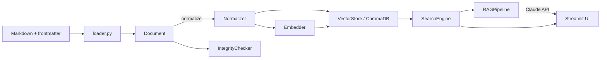

# Architecture

axis-knowledge-rag は、YAML frontmatter 付き Markdown ナレッジに対する
**軸メタデータ検索 + ベクトル検索 + RAG** を、ローカル完結で提供する Web アプリだ。
本書では、システム全体像・主要コンポーネントの責務・データフロー・テスト/デプロイ構成を順に説明する。
個別モジュールの API は [`api-reference.md`](api-reference.md)、設計判断の根拠は [`design-decisions.md`](design-decisions.md) に分離している。

---

## 1. 概要

- **目的**: 個人〜小規模チームのナレッジ (1k〜10k 件想定) を、構造化軸とベクトル検索を組み合わせて引ける
- **構成**: Python 単言語 (backend + Streamlit UI)。LangChain / LlamaIndex に依存しない自前実装
- **永続化**: ChromaDB の `PersistentClient` (ローカルファイル `.chromadb/`)
- **動作モード**: 通常モード (Gemini Embedding + Claude API) / DUMMY モード (オフラインで決定論的なフォールバック)

---

## 2. コンポーネント図 (ASCII)

```
            ┌─────────────────┐
            │ Markdown +      │
            │ YAML frontmatter│
            └────────┬────────┘
                     │ load
                     ▼
            ┌─────────────────┐    ┌──────────────────┐
            │  loader.py      │───►│   Document       │
            │ (frontmatter)   │    │   (@dataclass)   │
            └────────┬────────┘    └────────┬─────────┘
                     │                       │
              normalizer.py          (id/title/axes/tags/refs/body
                     │                       │  + normalized_* fields)
                     ▼                       │
            ┌─────────────────┐              │
            │ Normalized      │              │
            │ text + axes     │              │
            └────────┬────────┘              │
                     │                       │
                     ▼                       ▼
            ┌─────────────────┐    ┌──────────────────┐
            │  embedder.py    │    │  integrity.py    │
            │  (Gemini 768d)  │    │ (refs / cycles)  │
            └────────┬────────┘    └──────────────────┘
                     │
                     ▼
            ┌──────────────────────────────────────────┐
            │           vector_store.py                │
            │  ChromaDB PersistentClient (.chromadb/)  │
            │  ─ documents (body) / embeddings (768d)  │
            │  ─ metadata: axis_*  + axis_*_norm       │
            └──────────────┬───────────────────────────┘
                           ▲
              ┌────────────┼─────────────┐
              │            │             │
              │ query()    │ upsert()    │ query()
              │            │             │
        ┌─────┴────┐  ┌────┴────┐  ┌────┴──────┐
        │  search  │  │ build_  │  │  marker   │
        │ Engine   │  │ index   │  │ (.md re-  │
        │          │  │ (CLI)   │  │  gen)     │
        └────┬─────┘  └─────────┘  └───────────┘
             │
             │ retrieved docs
             ▼
        ┌──────────────┐
        │   rag.py     │  ── Claude API (or DUMMY)
        │ RAGPipeline  │
        └──────┬───────┘
               │
               ▼
        ┌──────────────┐
        │ Streamlit UI │  streamlit_app.py
        │ (port 8501)  │
        └──────────────┘
```

### 補助図 (Mermaid)



---

## 3. データフロー

### 3-1. Index time (ナレッジ取り込み)

`scripts/build_index.py <dir> [--reset] [--strict-integrity]` の流れ:

```
1. load_directory(dir) ──► list[Document]            (loader.py)
2. for d in docs: normalizer(d.body / d.axes / ...) (normalizer.py)
3. IntegrityChecker().check(docs)                   (integrity.py)
       └─ broken_refs / orphans / cycles を集計
       └─ --strict-integrity なら broken_refs 検出時に exit 1
4. embedder.embed_batch([d.normalized_body for d in docs])
       └─ Gemini API or DUMMY fallback             (embedder.py)
5. vector_store.upsert_many(docs, embeddings)
       └─ axis_* と axis_*_norm を metadata に flatten (vector_store.py)
```

### 3-2. Query time (検索 + 回答)

ユーザーが Streamlit UI でクエリを発行すると:

```
User query + axis filters
      │
      ▼
SearchEngine.search(query, filters, top_k)
      │   ├─ normalizer(query)          ← クエリも normalize
      │   ├─ embedder.embed(q_norm)
      │   └─ vector_store.query(emb, where=axis_*_norm)
      ▼
list[SearchResult]   (id, title, score, axes, snippet, refs)
      │
      ▼
RAGPipeline.answer(question, ...)
      ├─ context = _format_context(results)
      └─ Claude messages.create(system, user)  ── or DUMMY
      ▼
Answer (text, sources, cited_ids = [doc_NNN, ...])
      │
      ▼
Streamlit UI: 回答パネル + 出典カード
```

### 3-3. Update time (AUTO_GENERATED ブロック再生成)

`marker.py` を介したナレッジ Markdown 自体の再生成:

```
existing .md ──► extract_blocks() ──► [既存ブロック群]
                                            │
                  Claude API で要約等を生成 │
                                            ▼
                  update_block(text, name, new_content)
                                            │
                                            ▼
                            .md を上書き保存
                            (人間記述部分はそのまま)
```

---

## 4. コンポーネント責務一覧

| モジュール | 責務 | 主要依存 | 不変条件 |
|---|---|---|---|
| `backend/src/config.py` | 環境変数 + .env / `config.yml` の読み込み | `python-dotenv`, `pyyaml` | `Settings` は frozen dataclass |
| `backend/src/loader.py` | `*.md` → `Document` データクラス変換 | `python-frontmatter` | `id`/`title` 欠落で `LoaderError` |
| `backend/src/normalizer.py` | NFKC + カナ統一 + lowercase | 標準ライブラリのみ (`unicodedata`) | 冪等 (`f(f(x)) == f(x)`) |
| `backend/src/integrity.py` | refs / orphans / cycles 検出 | `loader.Document` | 純粋関数的、副作用なし |
| `backend/src/embedder.py` | テキスト→768 次元ベクトル変換 | `google-generativeai` | `GEMINI_API_KEY` 未設定なら DUMMY |
| `backend/src/vector_store.py` | ChromaDB ラッパ (upsert / query / reset) | `chromadb`>=0.5 | axis 値は `axis_<key>` / `axis_<key>_norm` の 2 列で保持 |
| `backend/src/search.py` | 軸フィルタ + ベクトル検索の hybrid | `embedder`, `vector_store`, `normalizer` | クエリも filter も normalize 経由で渡す |
| `backend/src/rag.py` | Claude API 呼び出し + 出典 ID 抽出 | `anthropic`, `search` | `ANTHROPIC_API_KEY` 未設定なら DUMMY |
| `backend/src/marker.py` | `<!-- AUTO_GENERATED_* -->` ブロック操作 | 標準ライブラリのみ (`re`) | START/END 名一致必須 (`validate_balance`) |
| `streamlit_app.py` | Web UI (サイドバー軸フィルタ + 回答パネル) | `streamlit`, 全 backend | `@st.cache_resource` で初期化を 1 回に固定 |
| `scripts/build_index.py` | コマンドラインからの index 構築 | `loader`, `embedder`, `vector_store`, `integrity` | `--reset` でコレクション drop → 再作成 |

### 依存方向

```
config.py
   ▲
   │
loader.py ◄── normalizer.py ◄── integrity.py
   ▲                  ▲
   │                  │
embedder.py           │
   ▲                  │
   │                  │
vector_store.py ──────┘
   ▲
   │
search.py
   ▲
   │
rag.py
   ▲
   │
streamlit_app.py / scripts/build_index.py / scripts/regen_summaries.py (v0.3 予定)
```

循環依存なし。下位レイヤは上位を知らない。

---

## 5. テストアーキテクチャ

- **テストフレームワーク**: `pytest >= 8` (Day 12 で `assert` ベース自前ランナーから移行)
- **共有 fixture**: `backend/tests/conftest.py`
  - `dummy_embedder` — `Embedder(force_dummy=True)`
  - `in_memory_store` — `VectorStore(in_memory=True)` (tmp_path で isolation)
  - `search_engine` — 上記 2 つを束ねた `SearchEngine`
  - `sample_documents` — id/axes/refs を網羅した最小データセット
- **DUMMY モードの位置づけ**:
  - 外部 API キーが無くてもパイプライン全体を流せる、テストの第一級市民
  - 埋め込みは SHA256 ハッシュ由来の決定的 768 次元ベクトル (意味的類似度はゼロ)
  - RAG の DUMMY 応答は「最上位ヒットの id とタイトルを返す」固定文字列ベース
- **カバレッジ**: 90 テスト / 72.49% (`pytest --cov-fail-under=70`)
- **CI**: `.github/workflows/ci.yml` で push/PR ごとに `ruff check` + `pytest`、Python 3.11/3.12 マトリクス

### モジュール別テストファイル

| モジュール | テストファイル | テスト数 |
|---|---|---|
| loader | `test_loader.py` | 4 |
| normalizer | `test_normalizer.py` | 19 (parametrize 含む) |
| embedder | `test_embedder.py` | 4 |
| vector_store | `test_vector_store.py` | 4 |
| search | `test_search.py` | 8 |
| rag | `test_rag.py` | 8 |
| integrity | `test_integrity.py` | 5 |
| marker | `test_marker.py` | 31 (parametrize 含む) |

---

## 6. デプロイメント

### Docker Compose

`docker-compose.yml` に 1 サービス (`app`)。

```yaml
services:
  app:
    build: .
    ports: ["8501:8501"]
    env_file: .env
    volumes:
      - chroma-data:/app/.chromadb
      - ./examples/knowledge:/app/examples/knowledge:ro
volumes:
  chroma-data:
```

- **永続化される data**: `chroma-data` named volume (`./.chromadb` ディレクトリ)
- **read-only マウント**: `examples/knowledge` (ホスト側で編集→コンテナで参照)
- **port**: `8501` (Streamlit デフォルト)

### Dockerfile

`python:3.11-slim` ベース、`pip install -e .`、起動時に `scripts/build_index.py` を実行してから `streamlit run`。

```
build → install → build_index → streamlit run
                                      │
                                      ▼
                                 :8501 LISTEN
```

### 環境変数

| 変数 | 必須 | 説明 |
|---|---|---|
| `ANTHROPIC_API_KEY` | optional | Claude API。未設定なら RAG が DUMMY モード |
| `GEMINI_API_KEY` | optional | Gemini Embedding。未設定なら埋め込みが DUMMY モード |
| `CHROMA_DB_PATH` | optional | 永続ディレクトリ (既定 `./.chromadb`) |
| `CLAUDE_MODEL` | optional | Claude モデル名 (既定 `claude-3-5-sonnet-20241022`) |
| `LOG_LEVEL` | optional | ログレベル (既定 `INFO`) |

### CI / CD

- `.github/workflows/ci.yml` — push/PR で ruff + pytest (matrix py311/py312)
- `.github/workflows/docker.yml` — push/PR で Docker build-only (GHA layer cache)
- 現時点で push 先 registry なし (v0.3 で GHCR 公開を検討)

---

## 7. 拡張ポイント (Week 2 以降)

| 拡張 | 触る場所 | 想定バージョン |
|---|---|---|
| Embedder を OpenAI / sentence-transformers に差し替え | `embedder.py` の抽象化 | v0.4 |
| LLM を Gemini / GPT に差し替え | `rag.py` の `_client` 抽象化 | v0.4 |
| chunking (長文ドキュメントの分割) | `loader.py` + `vector_store.py` | v0.4 |
| re-ranking (cross-encoder) | `search.py` の後段 | v0.4 |
| Next.js + FastAPI 移行 | `streamlit_app.py` 廃止、`backend/api/` 追加 | v0.3 |
| 自動 summary 生成 | `scripts/regen_summaries.py` + `marker.py` | v0.3 |

詳細な優先順位は [`spec-v2.md`](spec-v2.md) を参照。
